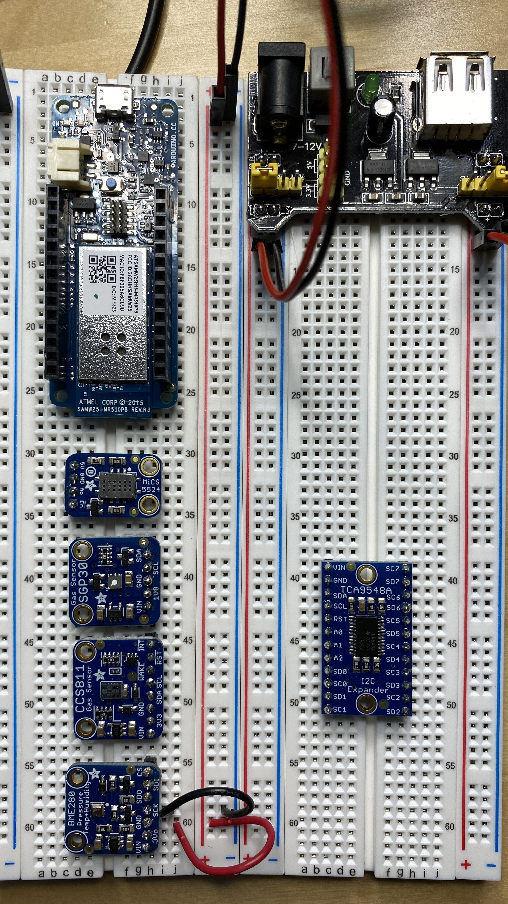

# Air Quality Sensor

## Components

### Microcontroller

* Arduino MKR1000
  * [Product page](https://store.arduino.cc/usa/arduino-mkr1000)
  * [diagrams](https://content.arduino.cc/assets/Pinout-MKR1000_latest.pdf)

### Integrated Circuits

#### MICS 5524 - Carbon Monoxide, Alcohol and VOC Gas Sensor

Sensor is sensitive to several gases but can't distinguish between which gas.

There is a burn in time for proper calibration that is required for the sensor
to work properly.

  * [Product page](https://www.adafruit.com/product/3199)
  * [Details](https://learn.adafruit.com/adafruit-mics5524-gas-sensor-breakout)
  * [manufacturer usage details](https://www.sgxsensortech.com/content/uploads/2014/08/AN-0172-SGX-Metal-Oxide-Gas-Sensors-V1.pdf)

Includes a voltage regulator

| specification | units |
| ----- | ---- |
| Input voltage  | 5v |
| current draw | 35 mA |

    
#### SGP30 - Gas Sensor

  * [Product page](https://www.adafruit.com/product/3709)
  * [Detailed arduino usage](https://learn.adafruit.com/adafruit-sgp30-gas-tvoc-eco2-mox-sensor/arduino-code)
  
VOC and eCO2 sensor

Uses i2c communication SCL and SDA can use 3v or 5v logic

Includes a voltage regulator

| specification | units |
| ----- | ---- |
| Input voltage  | 3v or 5v |

#### CCS811 - Gas Sensor

VOC and eCO2 Sensor

Measures eCO2 and TVOC. Can detect Alcohols, Aldehydes, Ketones, Organic Acids, Amines, Aliphatic and Aromatic Hydrocarbons.
Requires calibration

  * [Product page](https://www.adafruit.com/product/3566)
  * [Pinout](https://www.adafruit.com/product/3566)
  * [Detailed arduino usage](https://learn.adafruit.com/adafruit-ccs811-air-quality-sensor/arduino-wiring-test)
    
Includes voltage regulator

| specification | units |
| ----- | ---- |
| Input voltage  | 3v or 5v |
| Logic pin voltage | 3v or 5v |
  
#### BME280 - Pressure, temp, humidity
  * [Product page](https://www.adafruit.com/product/2652)
  
 temperature, barometric pressure and humidity sensor 

#### PMS5003 - Digital Particle Concentration Laser Sensor

  * [Product page](https://www.adafruit.com/product/3686)
  
PM2.5 Air Quality Sensor

#### TCA9548A

i2c multiplexer

  * [Product page](https://www.adafruit.com/product/2717)
  * [Details and usage](https://learn.adafruit.com/adafruit-tca9548a-1-to-8-i2c-multiplexer-breakout/overview)
  * [detailed arduino usage](https://learn.adafruit.com/adafruit-tca9548a-1-to-8-i2c-multiplexer-breakout/wiring-and-test)

Includes voltage regulator

| specification | units |
| ----- | ---- |
| Input voltage  | 3v or 5v |
| Logic pin voltage | 3v or 5v |
